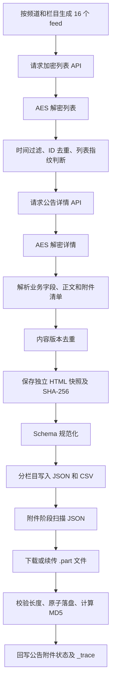

# SXJM 网站爬取实现与运行说明

## 1. 文档目的

本文说明当前 Scrapy 框架中“山西焦煤电子招采平台”（以下简称 SXJM）的实际
爬取实现，包括：

- 网站接口、频道、栏目和公告类型；
- 列表与详情数据的请求、解密和解析；
- 源站公告类型与公共字段 Schema 的关系；
- JSON、CSV、HTML 快照和附件的保存方式；
- 固定出口 IP 下的限速与主动停爬策略；
- 手动停止后的公告续跑和附件断点续传；
- 实时进度、日志、质量审计及常见故障处理。

本文以当前代码为准。主要实现文件如下：

| 文件 | 职责 |
|---|---|
| `crawler_scrapy/spiders/sxjm.py` | Scrapy Spider，负责列表、详情、时间范围和溯源上下文 |
| `crawler_scrapy/sites/sxjm/config.py` | 接口、频道、栏目、公告编码及类型映射 |
| `crawler_scrapy/sites/sxjm/parser.py` | AES 解密、HTML 清洗和业务字段提取 |
| `crawler_scrapy/sites/sxjm/exporter.py` | SXJM 分栏目 JSON/CSV 导出 |
| `crawler_scrapy/sites/sxjm/download_attachments.py` | 独立、可恢复的附件下载器 |
| `crawler_scrapy/sites/sxjm/audit.py` | 类型、正文、字段、附件和溯源质量审计 |
| `crawler_scrapy/pipelines.py` | 去重、HTML 快照、Schema 规范化和公共导出能力 |
| `run_sxjm.sh` | 推荐运行入口，负责限速、分批、续跑和阶段编排 |

## 2. 总体设计

SXJM 采集分为两个互不阻塞的阶段：

1. 公告阶段：抓列表和详情，解析字段，保存原始响应、HTML 快照、JSON、CSV
   以及附件清单，但不下载附件文件。
2. 附件阶段：读取公告 JSON 中的附件清单，独立下载文件，并将下载结果回写到
   对应公告的 JSON、`_trace` 和 CSV。



该运行入口不连接数据库，也不会直接写入 MySQL、MongoDB 或 MinIO。输出 JSON
的字段形状与现有导入器对应，后续是否入库由独立导入流程决定。

## 3. 源站接口与数据解密

### 3.1 接口

网站根地址：

```text
https://www.sxccdzzcpt.cn
```

列表接口：

```text
GET /api/portal/v1/announcement/index
```

主要参数：

| 参数 | 含义 |
|---|---|
| `page` | 页码，从 1 开始 |
| `per_page` | 每页数量，代码限制最大 100 |
| `announcement_type` | 源站公告编码 |
| `project_type` | 当前固定为空字符串 |
| `category` | 首页频道编码 |

详情接口：

```text
GET /api/portal/v1/announcement/details/<notice_id>
```

用户可访问的详情页链接单独保存为：

```text
https://www.sxccdzzcpt.cn/home/detail?id=<notice_id>
```

因此，`详情页链接` 保存的是用户页面，不是内部 API 地址。

### 3.2 AES 解密

列表和详情响应均是 JSON 信封，业务数据位于加密的 `result` 字段。解析器使用
与源站前端一致的 AES-128-CBC 和 PKCS#7 Padding 解密，流程为：

1. 读取 JSON 信封；
2. 对 `result` 做 Base64 解码；
3. 使用网站前端相同的固定 key/IV 执行 AES-CBC 解密；
4. 去除 Padding；
5. 将明文解析成 JSON 对象。

如果信封 `errcode` 非成功状态，或解密结果不是预期对象，当前响应不会进入字段
解析，并在日志中记录异常。

## 4. 频道、栏目和 16 个有效 feed

一个 feed 由 `(channel, section, announcement_type)` 唯一确定。当前共 16 个有效
feed：

| 频道 | `category` | 栏目代码 | 源站栏目 | `announcement_type` | 公共 Schema |
|---|---:|---|---|---:|---|
| `yfxm` | 1 | `zbjh` | 招标计划 | 19 | 招标计划 |
| `yfxm` | 1 | `zbgg` | 招标（预审）公告 | 8 | 招标公告 |
| `yfxm` | 1 | `hxr` | 中标候选人公示 | 2 | 中标候选人公示 |
| `yfxm` | 1 | `zbjg` | 结果公告 | 10 | 中标结果公示 |
| `yfxm` | 1 | `zzgg` | 终止公告 | 4 | 招标公告 |
| `zbxm` | 3 | `zbgg` | 招标（预审）公告 | 1 | 招标公告 |
| `zbxm` | 3 | `hxr` | 中标候选人公示 | 2 | 中标候选人公示 |
| `zbxm` | 3 | `zbjg` | 中标公告 | 3 | 中标结果公示 |
| `zbxm` | 3 | `zzgg` | 终止公告 | 4 | 招标公告 |
| `fzxm` | 2 | `cggg` | 采购（预审）公告 | 5 | 招标公告 |
| `fzxm` | 2 | `cjhxr` | 成交候选人公示 | 6 | 中标候选人公示 |
| `fzxm` | 2 | `cjgg` | 成交公告 | 7 | 中标结果公示 |
| `fzxm` | 2 | `zzgg` | 终止公告 | 4 | 招标公告 |
| `jycg` | 4 | `cggg` | 采购公告 | 5 | 招标公告 |
| `jycg` | 4 | `zzgg` | 终止公告 | 4 | 招标公告 |
| `jycg` | 4 | `cjgg` | 成交公告 | 7 | 中标结果公示 |

`yfxm` 的招标栏目使用 `announcement_type=8`。实际接口验证表明，该编码包含
普通招标、资格预审、延期、变更、澄清和补充等公告；
`category=1&announcement_type=1` 当前为空，因此代码不发送这个无效请求。

## 5. 公告类型模型

### 5.1 为什么区分源站类型和公共 Schema

公共框架使用固定字段 Schema，而源站存在“采购公告”“成交候选人公示”“成交
公告”“终止公告”等名称。如果直接把这些名称改成招标类名称，会造成业务类型
丢失；如果为每个名称重复创建完全相同的字段集合，又会产生冗余。

当前采用双层模型：

- `notice_subtype` 和 `fieldMeta.source_notice_type` 保留源站真实栏目；
- `notice_type` 使用公共 Schema 编码，决定字段校验和导出字段形状。

| 源栏目 | 源站中文类型 | 复用的公共 Schema | 导出编码 |
|---|---|---|---|
| `zbjh` | 招标计划 | 招标计划 | `PLAN` |
| `zbgg` | 招标公告 | 招标公告 | `TENDER` |
| `cggg` | 采购公告 | 招标公告 | `TENDER` |
| `hxr` | 中标候选人公示 | 中标候选人公示 | `CANDIDATE` |
| `cjhxr` | 成交候选人公示 | 中标候选人公示 | `CANDIDATE` |
| `zbjg` | 中标结果公示 | 中标结果公示 | `AWARD` |
| `cjgg` | 成交公告 | 中标结果公示 | `AWARD` |
| `zzgg` | 终止公告 | 招标公告 | `TERMINATION` |

例如，`fzxm.cjhxr` 仍表示“非招项目·成交候选人公示”，只是字段形状复用候选人
Schema；它不会在源站类型或数据库溯源中被错误改成“中标候选人公示”。

### 5.2 标题细分

源站偶尔把终止、撤销、延期、变更、更正、补充、澄清或资格预审公告放入聚合
栏目。解析器会优先依据标题识别 `源站公告性质`，避免只相信栏目导致误分类。

对于 `announcement_type=8`：

- 标题明确包含“招标公告”时，记录为招标公告；
- 标题明确包含“采购公告”时，记录为采购公告；
- 无法细分时，保留“依法项目招标（预审）及其他公告”。

标题包含“终止”或“撤销”的记录，导出编码按 `TERMINATION` 保存，但仍保留原
频道、栏目、标题和源站公告性质用于复核。

## 6. 公告阶段的请求流程

### 6.1 生成首批请求

Spider 根据 `channels` 和 `sections` 展开 feed，每个 feed 从第一页开始。列表
请求设置 `dont_filter=True`，使 JOBDIR 恢复或后续增量扫描时仍能重新读取列表。

### 6.2 列表处理

每个列表响应按以下顺序处理：

1. 解密业务信封；
2. 读取 `data` 和 `total`；
3. 解析发布时间并执行时间窗口过滤；
4. 过滤当前进程已见过的公告 ID；
5. 根据持久化公告索引判断是否需要请求详情；
6. 为需要处理的公告创建详情请求；
7. 在 `total`、`max_pages` 和每 feed 的 `max_records` 范围内请求下一页。

发布时间按以下优先级选择：

```text
publish_time_format -> publish_time -> created_at_format -> created_at
```

源站部分招标计划会把缺失发布时间写成 1970 年的 Unix 零值，代码会忽略该值并
回退到创建时间。

### 6.3 列表指纹

列表记录会生成稳定指纹。浏览量等易变化、无业务意义的字段不会触发详情重抓；
标题、发布时间等业务信息改变时，可以判断公告可能更新。

默认严格模式下，已成功导出的公告 ID 直接跳过详情。使用 `--check-updates` 后，
会根据列表指纹判断是否需要重新请求同一详情 URL。

### 6.4 详情请求的恢复设计

详情请求设置 `dont_filter=True`。跨运行是否需要抓取由公告版本索引决定，而不是
只依赖 Scrapy URL 去重。这样可以解决以下问题：

- 请求已经从 JOBDIR 出队，但在导出前进程被停止；
- 同一详情 URL 的公告内容后来发生变化；
- 需要显式执行 `--check-updates`。

同一进程仍通过 `_seen_ids` 防止同一公告被重复安排，导出前还有内容版本去重作为
最后保护。

## 7. 详情解析与字段提取

### 7.1 原始内容

解密后的详情对象会与列表记录组合用于解析，并保存到独立 payload 快照：

```text
payloads/...json -> list    解密后的列表记录
payloads/...json -> detail  解密后的详情对象
_trace.responseMetadata     列表请求、分页和详情业务信封上下文
```

详情对象的 `content` 是公告原始 HTML：

- 原值作为 `raw_html`；
- 按 DOM 顺序清洗后的文本作为 `raw_text` 和顶层 `公告正文`；
- `<p>`、表格行以及 `h1`～`h6` 按源顺序处理；
- 表格单元格、标题和段落的相对顺序尽量保留。

### 7.2 公共字段

所有公告都会尝试提取：

- 项目性质；
- 源站公告性质；
- 项目名称；
- 所属行业；
- 组织形式；
- 发布日期；
- 发布网站。

结构化详情字段优先；结构化字段为空时，再从正文标签、段落或上下文提取。

### 7.3 招标计划

招标计划主要提取：

- 招标方式、项目名称和项目类型；
- 项目总投资、招标内容；
- 招标人名称、行政监督部门；
- 建设地点、建设内容及规模；
- 招标公告预计发布时间。

### 7.4 招标、采购和终止类公告

`zbgg`、`cggg` 和 `zzgg` 复用招标公告字段结构，主要提取：

- 项目编号、项目类型、投资额、招标金额和资金来源；
- 项目地点、采购人、项目规模、工期、质量要求；
- 招标或采购内容与范围；
- 申请人、投标人或供应商资格要求；
- 文件获取时间和方式；
- 递交截止时间、递交方式；
- 开启时间、开启方式、开启地点；
- 评审办法、投标保证金方式；
- 招标人和代理机构的名称、地址、联系人、电话。

对于源站未显式给出开启方式，但正文明确出现“平台在线等待”“线上开标”等表述
时，会规范为“线上开启”，开启地点可回填为山西焦煤电子招采平台。

### 7.5 候选人类公告

`hxr` 和 `cjhxr` 优先按原始 HTML 表格表头识别：

- 标段；
- 候选人或候选供应商名称；
- 候选人报价。

支持“中标候选人”“成交候选人”“入围候选供应商”等源站表头变体。若 HTML
表格无法解析，再按清洗后的正文行结构回退提取。

名称和报价始终按同一表格行组合为明细，随后再派生名称列表和报价列表，避免
不同标段的公司与金额错位。

### 7.6 中标、成交结果类公告

`zbjg` 和 `cjgg` 同样优先解析表格，识别“中标人”“成交人”“成交单位”“成交
供应商”“成交（入围）人”等表头，并保存：

- 中标或成交结果明细；
- 中标或成交人名称；
- 中标价或成交金额；
- 联合体成员、工期、项目经理及证书；
- 依据文件和依据文号；
- 招标人、采购人和代理机构联系方式。

解析项目经理时会排除代理机构落款中的“签名”“签章”“项目负责人”，避免把公告
签署人误识别为中标项目经理。

### 7.7 联系方式

联系方式解析使用基于上下文的状态机区分招标人/采购人与代理机构。它支持标签
全部写在同一段的终止公告，同时排除“招标人或其代理机构（签章）”等模板落款。

### 7.8 附件清单

详情对象的 `document` 数组转换为统一附件结构：

```json
{
  "source_file_id": "源站文件ID",
  "file_name": "源文件名.pdf",
  "file_url": "https://www.sxccdzzcpt.cn/zcpt/...pdf",
  "storage_path": null,
  "file_hash": null,
  "file_size_bytes": null,
  "file_type": "application/pdf",
  "parse_status": "PENDING"
}
```

公告阶段只保存该清单，不下载文件，因此附件不会占用列表和详情请求的下载并发。

## 8. Pipeline 与导出顺序

公告 Item 依次经过：

| 顺序 | 组件 | 作用 |
|---:|---|---|
| 40 | `NoticeDedupPipeline` | 按公告身份和内容指纹过滤重复内容版本 |
| 50 | `HtmlSnapshotPipeline` | 保存独立 HTML 快照并回写路径、SHA-256 |
| 75 | `NoticeFilesPipeline` | 推荐入口中关闭，避免附件拖慢公告采集 |
| 100 | `NoticeSchemaPipeline` | 规范类型、字段和系统元数据，计算缺失字段 |
| 200 | `AiHtmlExtractionPipeline` | 推荐入口中关闭，不调用外部 AI |
| 300 | `SxjmMultiFormatPipeline` | 按 SXJM 频道和栏目输出 JSON、CSV |

只有 JSON 写入、CSV 写入和文件 flush 成功后，公告版本才提交到持久化去重索引，
避免“索引显示成功但数据文件没有落盘”。

## 9. HTML 快照和数据库溯源

### 9.1 独立快照

详情 `content` 的原始 HTML 保存为：

```text
new_output/sxjm/snapshots/<公共Schema输出目录>/<公告ID>_<SHA256前12位>.html
```

路径是相对于 `new_output` 的路径。相同公告 ID、相同 HTML 内容会得到相同文件名，
已存在时不会重复写入。

快照采用 SHA-256，写入：

- 顶层 `HTML快照路径`；
- 顶层 `HTML快照SHA256`；
- `_trace.payloadSnapshot.path/sha256`（原始接口载荷快照）。

### 9.2 JSON 溯源包

每条 JSON 的 `_trace` 包含：

| 字段 | 内容与数据库去向 |
|---|---|
| `payloadSnapshot` | 原始列表和详情载荷快照的路径、SHA256；导入后对应 MongoDB `raw_notices.payload` |
| `responseMetadata` | 列表/详情 HTTP 状态、请求上下文和业务信封 |
| `fieldMeta` | 频道、栏目、源站类型、Schema 类型及解析器版本 |
| `crawlerVersion` | 采集程序版本 |
| `extractionVersion` | 字段抽取规则版本 |
| `integrity` | 顶层正文的 SHA-256 |

快照文件用于采集机本地复核；导入器校验 SHA-256 后把原始 HTML、payload 和正文写入
MongoDB，因此 JSON 不再重复内嵌同一份大文本。现有数据库结构无需修改。

若源站极少数记录没有 `content`，快照 Pipeline 会告警但不会丢弃公告；解密后的
详情 JSON 仍保存在独立 payload 快照中。

## 10. 输出文件和目录

默认输出根目录为项目下的 `new_output`：

```text
new_output/
├── logs/
│   └── sxjm/
│       ├── <scope>_chunk_<批次>_<时间>.log
│       └── attachments_<时间>.log
└── sxjm/
    ├── json/
    │   └── <频道>_<栏目>.json
    ├── csv/
    │   └── <频道>_<栏目>.csv
    ├── snapshots/
    │   └── <公共Schema输出目录>/*.html
    ├── attachments/
    │   └── <公告类型>/<公告ID>/<源文件ID>_<文件名>
    └── state/
        ├── notice_versions.json
        ├── jobs/notices/<scope>/
        ├── runner/<scope>/
        └── resumable.lock
```

JSON 和 CSV 按 16 个真实频道/栏目路由分别命名，例如：

```text
依法项目_招标计划.json
招标项目_中标候选人公示.json
非招项目_成交公告.json
简易采购限额以下_终止公告.json
```

JSON 包含 `_trace`；CSV 不包含大型 `_trace`，但包含快照路径、快照哈希和序列化
后的附件字段。

## 11. 去重、停止和恢复

### 11.1 三层保护

当前续跑使用三层状态：

1. JOBDIR：保存 Scrapy 调度队列和请求状态；
2. 公告版本索引：保存公告身份、列表指纹和内容指纹；
3. 阶段完成标记：记录某一范围的公告阶段已正常完成。

任务 scope 由时间范围、频道、栏目、页大小、每 feed 数量和最大页数共同生成。同一
组参数会复用同一 JOBDIR；改变关键范围参数会生成新的 scope，避免状态串用。

### 11.2 手动停止

第一次按 `Ctrl-C` 时，Scrapy 会尽量优雅关闭，使当前已处理 Item 完成快照和导出。
状态目录不会删除。再次执行相同命令即可继续。

不建议连续快速按两次 `Ctrl-C`，第二次强制终止可能使正在处理的单个请求无法完成；
即使发生这种情况，详情请求仍可由持久化公告索引重新安排。

### 11.3 正常完成后的重跑

同一 scope 已有 `notices_complete` 标记时，默认重跑会跳过公告阶段，直接继续附件
阶段，避免附件阶段被停止后再次扫描全部公告。

需要重新扫描列表中的新 ID：

```bash
bash run_sxjm.sh --refresh-notices
```

需要检查已保存公告的内容更新：

```bash
bash run_sxjm.sh --check-updates
```

## 12. 固定出口 IP 保护

当前实现不是代理轮换或封禁绕过，而是固定出口下的保守限速与主动停止：

- 公告请求总并发和域名并发均为 1；
- 默认请求基础间隔为 6 秒，并启用随机化；
- AutoThrottle 目标并发为 0.20，最大延迟 180 秒；
- 普通 API 请求默认超时 300 秒；
- 公告 API 自动重试次数为 0；
- 默认每 400 个响应结束一批；
- 批次之间随机冷却 600～1200 秒；
- 第一次收到 403 或 429 即主动关闭，不继续重试冲击源站；
- HTTP 代理中间件关闭，不从未验证的代理静默回退。

这些措施可以降低固定 IP 被限流的风险，但不能保证源站永远不会封禁。收到 403、
429 或验证码要求后，应停止并等待源站允许的时间，不应通过伪造身份绕过限制。

## 13. 独立附件下载

### 13.1 为什么与公告分离

PDF 或大型文档可能需要数分钟下载。如果附件与详情 Item 绑定在同一个 Scrapy
Pipeline 中，慢附件会占用公告处理链路，导致列表翻页和正文导出一起变慢。

当前推荐入口在公告阶段显式设置：

```text
NOTICE_ATTACHMENT_DOWNLOAD_ENABLED=False
```

公告完成后，再由 `download_attachments.py` 扫描 JSON。

### 13.2 附件与公告对应

附件确定性路径为：

```text
sxjm/attachments/<公告类型>/<公告ID>/<source_file_id>_<file_name>
```

路径同时包含公告 ID 和源站文件 ID。下载结果按 JSON 文件、公告行、附件数组下标
回写，保证不会把附件写到其他公告。

回写位置包括：

- 顶层 `附件`；
- 同名 CSV 的 `附件` 列。

### 13.3 超时和重试

默认参数：

| 参数 | 默认值 | 含义 |
|---|---:|---|
| 连接超时 | 30 秒 | 建立 TCP/TLS 连接的最大等待 |
| 读取超时 | 900 秒 | 两次流读取之间允许的最大等待，不是整个文件总时长 |
| 普通错误重试 | 4 次 | 初始请求之外最多再重试 4 次 |
| 文件间隔 | 2～5 秒 | 每次真实网络下载后的随机等待 |

普通网络错误和 5xx 使用指数退避。403/429 不进入普通重试，立即结束附件阶段并
返回状态码 3。

附件下载器只允许 HTTPS 且主机为 `www.sxccdzzcpt.cn`，并关闭 `requests` 对环境
代理变量的继承，避免输出出口被环境配置静默改变。

### 13.4 断点续传与完整性

下载中的文件使用 `.part` 后缀：

1. 如果 `.part` 已存在，发送 `Range: bytes=<现有大小>-`；
2. 服务器返回 206 时追加剩余内容；
3. 服务器忽略 Range 并返回 200 时，从头覆盖临时文件；
4. 根据 `Content-Length` 校验实际长度；
5. 刷盘后原子改名为最终文件；
6. 最终文件已存在且非空时，重新运行会直接跳过下载。

附件 `file_hash` 使用 MD5，以保持与现有 Scrapy `FilesPipeline` 的 checksum 约定
一致；HTML 快照和 `_trace.integrity` 使用 SHA-256，两者不要混淆。

附件状态包括：

| 状态 | 含义 |
|---|---|
| `PENDING` | 公告阶段只获取了附件清单 |
| `DOWNLOADED_NO_OCR` | 本次成功下载，尚未 OCR |
| `CACHED_NO_OCR` | 文件已存在，跳过重复下载 |
| `MISSING_URL` | 源站附件记录没有下载地址 |
| `DOWNLOAD_FAILED` | 放宽超时并重试后仍失败 |

附件阶段不做 PDF 文本提取、OCR 或 AI 识别。

## 14. 实时进度和日志

公告阶段会输出两类实时日志：

```text
[SXJM列表进度] 频道=... 栏目=... 页=... 本页=... 总数=... 新增详情=...
[SXJM公告进度] 本次已保存=... 公告ID=... 栏目=... 类型=... 标题=...
```

Scrapy 还会每 15 秒输出请求数、响应数、Item 数和速率统计。

附件阶段每处理一个附件输出：

```text
[附件进度] 12/300 下载=8 已有=3 失败=1 公告ID=... 状态=... 文件=...
```

终端内容同时通过 `tee` 写入 `new_output/sxjm/logs/`，因此关闭终端显示后仍可根据
日志复核每一批的结束原因。

## 15. 推荐运行方式

### 15.1 环境

```bash
cd /home/intsig/Crawler_Scrapy
pip install -r requirements.txt
```

入口按以下顺序选择 Python：

1. 环境变量 `CRAWLER_PYTHON_COMMAND`；
2. 项目 `.venv/bin/python`；
3. 当前服务器 `/home/vipuser/miniconda3/envs/myenv/bin/python`；
4. 系统 `python3`。

选择后会检查 `scrapy` 和 `requests` 是否可导入。

### 15.2 默认运行

默认抓最近 180 天，先公告、后附件：

```bash
bash run_sxjm.sh
```

### 15.3 全部历史

```bash
bash run_sxjm.sh --all
```

完整历史可能耗时很长。默认分批和冷却策略会优先保护固定出口 IP，不应为了追求
速度直接取消所有延迟。

### 15.4 指定日期

```bash
bash run_sxjm.sh \
  --start-date 2026-01-01 \
  --end-date 2026-06-30
```

只指定起始日期时，会抓取从该日期到源站当前数据范围。

### 15.5 分阶段运行

```bash
# 只抓公告、字段、HTML快照和附件清单
bash run_sxjm.sh --phase notices --all

# 独立下载 JSON 中尚未完成的附件
bash run_sxjm.sh --phase attachments
```

### 15.6 选择频道和栏目

只抓非招项目：

```bash
bash run_sxjm.sh \
  --phase notices \
  --channels fzxm \
  --sections cggg,cjhxr,cjgg,zzgg \
  --days 30
```

运行脚本也支持管理端栏目别名：

| 管理端参数 | 展开的源站栏目 |
|---|---|
| `zbgg_zys` | `zbgg,cggg` |
| `hxr` | `hxr,cjhxr` |
| `gs` | `zbjg,cjgg` |
| `zbjh` | `zbjh` |
| `zzgg` | `zzgg` |

### 15.7 小规模验证

每个有效 feed 最多抓 5 条：

```bash
bash run_sxjm.sh \
  --phase notices \
  --days 30 \
  --page-size 5 \
  --max-records 5 \
  --max-pages 2
```

注意：`max_records` 是每个 feed 的上限，不是整个 Spider 的总上限。默认 16 个
feed，理论上最多可输出 80 条。

只验证前 5 个附件：

```bash
bash run_sxjm.sh \
  --phase attachments \
  --max-attachments 5
```

### 15.8 调整限速和附件超时

```bash
bash run_sxjm.sh \
  --delay-min 3 \
  --delay-max 5 \
  --responses-per-chunk 150 \
  --cooldown-min 180 \
  --cooldown-max 300 \
  --attachment-connect-timeout 60 \
  --attachment-read-timeout 1200 \
  --attachment-retries 5
```

## 16. 质量审计

SXJM 专用审计以“每个 feed 抓取固定条数”的测试任务为目标。当前默认期望每个 feed
为 5 条，因此推荐在执行每 feed 5 条的小规模任务后运行：

```bash
/home/vipuser/miniconda3/envs/myenv/bin/python \
  -m crawler_scrapy.sites.sxjm.audit new_output \
  --expected-per-feed 5 \
  --report new_output/sxjm/audit_report.json
```

如果测试任务使用其他固定条数，应把 `--expected-per-feed` 改成相同值。完整历史或
普通增量任务中，各 feed 实际条数通常不同；此时报告中的字段和正文检查仍可参考，
但固定数量检查会按设计报告不一致，不能只用进程退出码判断整批历史数据质量。

审计内容包括：

- 16 个 feed 的记录数；
- `notice_subtype`、源站类型、Schema 和导出编码是否一致；
- 公告正文是否存在且哈希可复核；
- HTML 快照和原始 payload 快照是否存在、SHA256 是否一致；
- 候选人、中标人或成交人是否能在正文中复核；
- 附件名称和 URL 是否完整；
- 各 feed 的正文长度和缺失字段统计。

## 17. 快照和附件人工核验

查找快照：

```bash
find new_output/sxjm/snapshots -type f -name '*.html' | head
```

校验某个快照的 SHA-256：

```bash
sha256sum 'new_output/sxjm/snapshots/03_招标公告/<文件名>.html'
```

结果应与对应 JSON 的 `HTML快照SHA256` 和
`_trace.integrity.rawHtmlSha256` 一致。

查找未完成附件：

```bash
find new_output/sxjm/attachments -type f -name '*.part'
```

查看下载失败状态：

```bash
rg 'DOWNLOAD_FAILED|MISSING_URL' new_output/sxjm/json
```

## 18. 退出状态和故障处理

| 状态码 | 含义 | 建议处理 |
|---:|---|---|
| 0 | 当前阶段正常完成 | 无需处理 |
| 1 | Scrapy、日志或未知运行错误 | 检查对应日志末尾和 `finish_reason` |
| 2 | 参数、Python 环境或输出结构错误 | 修正命令或依赖环境 |
| 3 | 收到 403/429 | 停止请求，等待后再用相同命令续跑 |
| 4 | 至少一个附件最终失败 | 检查网络、源 URL，随后重跑附件阶段 |
| 5 | 同一输出目录已有任务持锁运行 | 不要并行修改相同 JSON，等待现有任务结束 |
| 130 | 用户手动停止 | 使用相同命令继续 |

### 18.1 公告阶段收到 403/429

日志会出现：

```text
SXJM_ACCESS_BLOCKED
direct_access_blocked
```

脚本不会自动重试。等待出口恢复后，重新执行完全相同的命令即可。

### 18.2 附件阶段长时间没有完成

读取超时是连续流读取的等待上限。只要服务器持续返回数据，大文件可以下载超过
900 秒。不要仅因为总下载时长超过 15 分钟就判断超时。

如果人工停止，保留 `.part` 文件；下次运行优先续传。

### 18.3 JSON 和 CSV 行数不一致

附件下载器只有在同名 JSON、CSV 数据行数一致时才回写 CSV。若行数不一致，会
保留 JSON 的正确结果并输出警告，不会按错误行号修改 CSV。此时应先核对文件是否
被人工编辑或被两个进程同时运行。

### 18.4 空 HTML

空 HTML 不会导致公告丢失。应检查：

- payload 快照中的 `detail` 是否包含结构化字段；
- 附件中是否包含完整公告 PDF；
- 日志中的“无法保存 HTML 快照”告警。

## 19. 当前实现边界

- 网站访问使用固定公网出口和保守限速，不提供代理池或封禁绕过；
- HTML 是详情 API `content` 的源站原文，不执行浏览器 JavaScript 渲染；
- 附件只下载和校验，不做 PDF 文本提取、OCR 或 AI；
- AI 字段补全在推荐入口中关闭，字段来自结构化详情和网站规则解析；
- 默认严格跳过已保存公告 ID，检查历史更新必须显式使用 `--check-updates`；
- `--days 180` 是滚动窗口，同一 scope 完成后需要使用 `--refresh-notices` 扫描后来
  新增的公告；
- 本脚本只产出可追溯文件，不自动执行数据库导入。

### 19.1 可选的入库前 dry-run

如需验证当前 JSON、快照字段和附件能否被现有导入流程读取，可执行只读 dry-run：

```bash
cd /home/intsig/crawler_prisma/new_scripts
npm run import:all -- \
  --site=sxjm \
  --output-root=/home/intsig/Crawler_Scrapy/new_output
```

不带 `--commit` 时只读取和验证文件，不连接或修改数据库。正式导入属于独立操作，
不在 `run_sxjm.sh` 的职责范围内。

## 20. 交付验证状态

当前实现已经通过以下自动测试：

- 16 个 feed 配置和源站编码；
- AES 信封解密；
- 真实栏目与公共 Schema 类型映射；
- 招标计划、采购公告、候选人和结果字段解析；
- 多标段公司与金额配对；
- 终止、撤销、延期、变更等公告性质识别；
- 列表与详情原始溯源；
- HTML 快照、SHA-256、JSON 和数据库导入元数据一致性；
- 附件确定性路径、已存在文件跳过和 `.part` Range 续传；
- 403 首次出现立即停止且不重试；
- 完整项目回归测试。

最近一次完整测试结果为：

```text
154 passed
```
