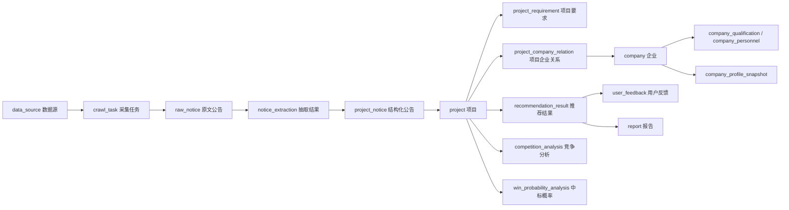

# 智投决策 - 项目推荐智能体数据库文档

版本：v1.0  
日期：2026-07-01  
数据库：MySQL 8.0  
ORM：Prisma

本文基于以下来源整理：

- `C:\Users\byan\Desktop\jc\后期优化方向.md`
- `api/prisma/schema.prisma`
- `api/prisma/migrations/*/migration.sql`
- `api/prisma/seed.ts`
- `docs/数据库建模.md`
- `docs/数据库建模实现状态清单.md`

说明：生成本文档时本地未检测到正在运行的 MySQL 容器，因此“当前实际库”以 Prisma schema、migration 和 seed 为准；如果后续本地库已启动，建议再用 `prisma db pull` 或信息架构表核对一次。

---

## 1. 总体结论

当前数据库已经从纯 mock 演示进入 MySQL + Prisma 的基础事实表阶段，但还没有达到后期优化方案要求的完整推荐决策平台形态。

当前已实现：

- MySQL 数据源已接入 Prisma。
- 已有 10 张业务表：9 张核心事实/画像表 + 1 张收藏表。
- 已有项目、公告、附件、企业、企业别名、项目企业关系、联合体成员、项目人员、画像快照、用户收藏等基础结构。
- seed 可写入演示数据，用于推荐列表、项目详情、Dashboard 和收藏功能联调。

目标优化后：

- 总表数扩展为 26 张。
- 新增采集域、解析域、推荐域、竞争分析域、中标概率域、企业画像子表、合同履约、报告、系统字典等表。
- 将当前写在 `project_notice.structured_data` 中的推荐分、推荐理由、风险提示等演示数据迁移到正式结果表。
- 为后续爬虫、PDF 解析、推荐引擎、竞争分析、中标概率分析、报告生成和管理后台运营预留稳定的数据边界。

---

## 2. 建模原则

### 2.1 分层原则

数据库按业务职责分为 6 层：

| 层级 | 说明 | 代表表 |
|---|---|---|
| 采集层 | 保存外部公告原文、来源、附件和采集任务 | `data_source`、`crawl_task`、`raw_notice`、`raw_notice_attachment` |
| 解析层 | 保存解析器抽取结果和项目要求 | `notice_extraction`、`project_requirement` |
| 事实层 | 保存企业、项目、公告、参与关系等客观事实 | `company`、`project`、`project_notice`、`project_company_relation` |
| 画像层 | 保存企业资质、人员和画像快照 | `company_qualification`、`company_personnel`、`company_profile_snapshot` |
| 结果层 | 保存推荐、竞争分析、中标概率、报告等计算结果 | `recommendation_result`、`competition_analysis`、`win_probability_analysis`、`report` |
| 基础层 | 保存字典、反馈、收藏等基础业务数据 | `sys_dict`、`user_feedback`、`user_favorite` |

### 2.2 事实和结论分离

核心事实表只保存客观数据，例如企业、项目、公告、投标关系、合同、人员、资质。

推荐分、竞争强度、中标概率、推荐理由、风险提示、策略建议属于算法或规则计算结果，应落在结果层表中，避免污染事实层。

当前为了 MVP 演示，推荐分暂存在 `project_notice.structured_data` 中。后续应迁移到 `recommendation_result`、`competition_analysis` 和 `win_probability_analysis`。

### 2.3 枚举治理策略

后续新增业务枚举建议使用 `VARCHAR` + 代码层 Zod enum + `sys_dict` 统一治理，避免 MySQL `ENUM` 在迭代期频繁 `ALTER TABLE`。

当前例外：

- `user_favorite.status` 已通过 Prisma enum 生成 MySQL `ENUM('pending','following','bid','abandoned')`。

后续可以保留该现状，也可以在统一治理时迁移为 `VARCHAR(32)`。

### 2.4 命名规范

- 数据库表名使用小写下划线：`project_notice_attachment`。
- 数据库字段使用小写下划线：`project_id`、`created_at`。
- Prisma model 使用 PascalCase：`ProjectNoticeAttachment`。
- Prisma 字段使用 camelCase，并通过 `@map` 映射数据库字段：`projectId @map("project_id")`。
- 金额统一使用 `DECIMAL(18,2)`。
- 概率和评分统一使用 `DECIMAL(5,2)` 或 `DECIMAL(5,4)`。
- 长文本使用 `TEXT` / `LONGTEXT`。
- 半结构化扩展使用 MySQL `JSON`。
- 时间字段优先使用 `DATETIME(3)`，由 Prisma 映射为 `DateTime`。

---

## 3. 数据流总览



---

## 4. 表清单

| 序号 | 表名 | 所属域 | 当前状态 | 说明 |
|---:|---|---|---|---|
| 1 | `company` | 事实层 | 已实现，需扩展 | 企业主数据 |
| 2 | `company_alias` | 事实层 | 已实现 | 企业别名和原始名称归一 |
| 3 | `project` | 事实层 | 已实现，需扩展全文索引 | 项目主数据 |
| 4 | `user_favorite` | 基础层 | 已实现 | 用户收藏项目 |
| 5 | `project_notice` | 事实层 | 已实现，需扩展全文索引 | 公告结构化和原文内容 |
| 6 | `project_notice_attachment` | 事实层 | 已实现，需扩展附件解析字段 | 公告附件 |
| 7 | `project_company_relation` | 事实层 | 已实现，需补唯一约束 | 项目和企业参与关系 |
| 8 | `project_consortium_member` | 事实层 | 已实现 | 联合体成员 |
| 9 | `project_company_person` | 事实层 | 已实现 | 项目相关人员 |
| 10 | `company_profile_snapshot` | 画像层 | 已实现，需补唯一约束 | 企业画像快照 |
| 11 | `data_source` | 采集层 | 待新增 | 数据源配置 |
| 12 | `crawl_task` | 采集层 | 待新增 | 采集任务 |
| 13 | `raw_notice` | 采集层 | 待新增 | 原始公告归档 |
| 14 | `raw_notice_attachment` | 采集层 | 待新增 | 原文附件归档 |
| 15 | `notice_extraction` | 解析层 | 待新增 | 公告字段抽取结果 |
| 16 | `project_requirement` | 解析层 | 待新增 | 项目资格、技术、业绩要求 |
| 17 | `recommendation_result` | 结果层 | 待新增 | 推荐结果 |
| 18 | `user_feedback` | 基础层 | 待新增 | 用户对推荐结果的反馈 |
| 19 | `recommendation_model_version` | 结果层 | 待新增 | 推荐模型/算法版本 |
| 20 | `competition_analysis` | 结果层 | 待新增 | 竞争分析结果 |
| 21 | `win_probability_analysis` | 结果层 | 待新增 | 中标概率分析结果 |
| 22 | `company_qualification` | 画像层 | 待新增 | 企业资质证书 |
| 23 | `company_personnel` | 画像层 | 待新增 | 企业技术人员 |
| 24 | `contract` | 事实层 | 待新增 | 合同和履约信息 |
| 25 | `report` | 结果层 | 待新增 | 生成报告 |
| 26 | `sys_dict` | 基础层 | 待新增 | 系统字典 |

---

## 5. 当前已实现表结构

### 5.1 `company` 企业表

用途：系统中的企业主数据，包括供应商、采购方、代理机构、竞争企业等。

| 字段 | 类型 | 约束 | 说明 |
|---|---|---|---|
| `id` | INT | PK, AUTO_INCREMENT | 企业 ID |
| `company_name` | VARCHAR(191) | NOT NULL | 标准企业名称 |
| `credit_code` | VARCHAR(191) | UNIQUE, NULL | 统一社会信用代码 |
| `province` | VARCHAR(191) | NULL | 省份 |
| `city` | VARCHAR(191) | NULL | 城市 |
| `company_type` | VARCHAR(191) | NULL | 企业类型 |
| `qualification_level` | VARCHAR(191) | NULL | 当前简化资质等级 |
| `business_scope` | TEXT | NULL | 经营范围 |
| `created_at` | DATETIME(3) | NOT NULL, DEFAULT CURRENT_TIMESTAMP | 创建时间 |
| `updated_at` | DATETIME(3) | NOT NULL | 更新时间 |

已实现索引：

- UNIQUE `company_credit_code_key` (`credit_code`)
- INDEX `company_company_name_idx` (`company_name`)

后续扩展字段：

| 字段 | 类型 | 说明 |
|---|---|---|
| `registered_capital` | DECIMAL(18,2) | 注册资本 |
| `established_date` | DATE | 成立日期 |
| `legal_person` | VARCHAR(64) | 法定代表人 |
| `employee_count` | INT | 员工人数 |

后续扩展索引：

- FULLTEXT `company_company_name_ft` (`company_name`) WITH PARSER ngram

### 5.2 `company_alias` 企业别名表

用途：处理同一企业在不同公告、不同来源中的名称差异。

| 字段 | 类型 | 约束 | 说明 |
|---|---|---|---|
| `id` | INT | PK, AUTO_INCREMENT | 主键 |
| `company_id` | INT | FK -> `company.id` | 企业 ID |
| `alias_name` | VARCHAR(191) | NOT NULL | 企业别名或原始名称 |
| `source` | VARCHAR(191) | NULL | 来源站点或来源公告 |
| `created_at` | DATETIME(3) | NOT NULL, DEFAULT CURRENT_TIMESTAMP | 创建时间 |

已实现索引：

- INDEX `company_alias_company_id_idx` (`company_id`)
- INDEX `company_alias_alias_name_idx` (`alias_name`)

### 5.3 `project` 项目表

用途：项目主数据，保存跨公告稳定、可复用的结构化字段。

| 字段 | 类型 | 约束 | 说明 |
|---|---|---|---|
| `id` | INT | PK, AUTO_INCREMENT | 项目 ID |
| `project_code` | VARCHAR(191) | NULL | 项目编号/招标编号 |
| `project_name` | VARCHAR(191) | NOT NULL | 项目名称 |
| `project_nature` | VARCHAR(191) | NULL | 项目性质 |
| `industry` | VARCHAR(191) | NULL | 所属行业 |
| `project_type` | VARCHAR(191) | NULL | 项目类型 |
| `tender_method` | VARCHAR(191) | NULL | 招标方式 |
| `organization_form` | VARCHAR(191) | NULL | 组织形式 |
| `province` | VARCHAR(191) | NULL | 项目省份 |
| `city` | VARCHAR(191) | NULL | 项目城市 |
| `location_text` | TEXT | NULL | 项目地点原文 |
| `owner_company_id` | INT | FK -> `company.id`, NULL | 招标人企业 ID |
| `owner_company_name` | VARCHAR(191) | NULL | 招标人名称原文 |
| `agency_company_name` | VARCHAR(191) | NULL | 招标代理机构名称 |
| `estimated_amount` | DECIMAL(18,2) | NULL | 估算金额/总投资 |
| `tender_amount` | DECIMAL(18,2) | NULL | 招标金额/预算金额 |
| `fund_source` | VARCHAR(191) | NULL | 资金来源 |
| `bid_open_time` | DATETIME(3) | NULL | 开标时间 |
| `duration` | VARCHAR(191) | NULL | 工期/服务期/合同期限 |
| `quality_requirement` | TEXT | NULL | 质量要求 |
| `supervisor_department` | VARCHAR(191) | NULL | 行政监督部门 |
| `current_status` | VARCHAR(191) | NOT NULL, DEFAULT 'TENDER' | 当前项目状态 |
| `first_publish_date` | DATETIME(3) | NULL | 首次发布日期 |
| `created_at` | DATETIME(3) | NOT NULL, DEFAULT CURRENT_TIMESTAMP | 创建时间 |
| `updated_at` | DATETIME(3) | NOT NULL | 更新时间 |

已实现索引：

- INDEX `project_project_code_idx` (`project_code`)
- INDEX `project_project_name_idx` (`project_name`)
- INDEX `project_current_status_province_city_industry_idx` (`current_status`, `province`, `city`, `industry`)

后续扩展索引：

- FULLTEXT `project_project_name_ft` (`project_name`) WITH PARSER ngram

### 5.4 `user_favorite` 用户收藏表

用途：保存用户对项目的收藏和跟进状态。

| 字段 | 类型 | 约束 | 说明 |
|---|---|---|---|
| `id` | INT | PK, AUTO_INCREMENT | 收藏 ID |
| `user_id` | INT | NOT NULL | 用户 ID；当前接口中硬编码为 1 |
| `project_id` | INT | FK -> `project.id` | 项目 ID |
| `status` | ENUM | NOT NULL, DEFAULT 'pending' | 收藏跟进状态 |
| `note` | TEXT | NULL | 备注 |
| `created_at` | DATETIME(3) | NOT NULL, DEFAULT CURRENT_TIMESTAMP | 创建时间 |
| `updated_at` | DATETIME(3) | NOT NULL | 更新时间 |

已实现索引：

- UNIQUE `user_favorite_user_id_project_id_key` (`user_id`, `project_id`)
- INDEX `user_favorite_user_id_idx` (`user_id`)
- INDEX `user_favorite_project_id_idx` (`project_id`)
- INDEX `user_favorite_status_idx` (`status`)
- INDEX `user_favorite_created_at_idx` (`created_at`)

当前枚举值：

| 值 | 说明 |
|---|---|
| `pending` | 待处理 |
| `following` | 跟进中 |
| `bid` | 已投标 |
| `abandoned` | 已放弃 |

后续建议：

- 用户上下文接入后移除 `user_id = 1` 硬编码。
- 收藏列表排序分页改为数据库侧排序分页，避免应用层内存排序分页。

### 5.5 `project_notice` 公告表

用途：保存项目下的各类公告、公告全文和公告级结构化字段。

| 字段 | 类型 | 约束 | 说明 |
|---|---|---|---|
| `id` | INT | PK, AUTO_INCREMENT | 公告 ID |
| `project_id` | INT | FK -> `project.id` | 所属项目 |
| `notice_type` | VARCHAR(191) | NOT NULL | 公告类型 |
| `title` | VARCHAR(512) | NOT NULL | 公告标题 |
| `content` | LONGTEXT | NULL | 公告全文 |
| `structured_data` | JSON | NULL | 公告结构化字段或临时演示数据 |
| `publish_date` | DATETIME(3) | NULL | 发布日期 |
| `source_site` | VARCHAR(191) | NULL | 来源网站 |
| `source_url` | VARCHAR(1024) | NULL | 原始链接 |
| `source_notice_id` | VARCHAR(191) | NULL | 源站公告 ID |
| `crawl_time` | DATETIME(3) | NULL | 爬取时间 |
| `created_at` | DATETIME(3) | NOT NULL, DEFAULT CURRENT_TIMESTAMP | 入库时间 |

已实现索引：

- INDEX `project_notice_project_id_idx` (`project_id`)
- INDEX `project_notice_notice_type_idx` (`notice_type`)
- INDEX `project_notice_publish_date_idx` (`publish_date`)
- INDEX `project_notice_source_notice_id_idx` (`source_notice_id`)
- INDEX `project_notice_notice_type_publish_date_idx` (`notice_type`, `publish_date`)

后续扩展索引：

- FULLTEXT `project_notice_title_ft` (`title`) WITH PARSER ngram
- FULLTEXT `project_notice_content_ft` (`content`) WITH PARSER ngram

当前注意事项：

- MVP 中 `structured_data` 临时保存 `matchScore`、`winProbability`、`level`、`competition`、`reason`、`risk`。
- 后续正式推荐结果应迁移到 `recommendation_result`，中标概率迁移到 `win_probability_analysis`。

### 5.6 `project_notice_attachment` 公告附件表

用途：保存公告附件链接和基础文件类型。

| 字段 | 类型 | 约束 | 说明 |
|---|---|---|---|
| `id` | INT | PK, AUTO_INCREMENT | 附件 ID |
| `notice_id` | INT | FK -> `project_notice.id` | 公告 ID |
| `file_name` | VARCHAR(191) | NOT NULL | 附件名称 |
| `file_url` | VARCHAR(1024) | NULL | 附件链接 |
| `file_type` | VARCHAR(191) | NULL | 文件类型 |
| `created_at` | DATETIME(3) | NOT NULL, DEFAULT CURRENT_TIMESTAMP | 创建时间 |

已实现索引：

- INDEX `project_notice_attachment_notice_id_idx` (`notice_id`)

后续扩展字段：

| 字段 | 类型 | 说明 |
|---|---|---|
| `storage_path` | VARCHAR(1024) | 本地或对象存储路径 |
| `file_hash` | VARCHAR(64) | 文件哈希 |
| `file_size_bytes` | BIGINT | 文件大小 |
| `parse_status` | VARCHAR(32) DEFAULT 'PENDING' | 附件解析状态 |

### 5.7 `project_company_relation` 项目企业关系表

用途：记录企业在某项目、某公告阶段中的角色，是画像、竞争分析、中标概率和推荐特征的核心事实表。

| 字段 | 类型 | 约束 | 说明 |
|---|---|---|---|
| `id` | INT | PK, AUTO_INCREMENT | 主键 |
| `project_id` | INT | FK -> `project.id` | 项目 ID |
| `notice_id` | INT | FK -> `project_notice.id`, NULL | 来源公告 ID |
| `company_id` | INT | FK -> `company.id`, NULL | 归一后的企业 ID |
| `company_name` | VARCHAR(191) | NOT NULL | 公告中的企业名称原文 |
| `relation_type` | VARCHAR(191) | NOT NULL | 企业与项目关系 |
| `stage_type` | VARCHAR(191) | NULL | 所属公告阶段 |
| `ranking` | INT | NULL | 候选排名 |
| `bid_amount` | DECIMAL(18,2) | NULL | 报价/中标金额 |
| `is_winner` | BOOLEAN | NOT NULL, DEFAULT false | 是否中标 |
| `is_consortium` | BOOLEAN | NOT NULL, DEFAULT false | 是否联合体 |
| `is_consortium_leader` | BOOLEAN | NOT NULL, DEFAULT false | 是否联合体牵头方 |
| `created_at` | DATETIME(3) | NOT NULL, DEFAULT CURRENT_TIMESTAMP | 创建时间 |

已实现索引：

- INDEX `project_company_relation_project_id_idx` (`project_id`)
- INDEX `project_company_relation_company_id_idx` (`company_id`)
- INDEX `project_company_relation_notice_id_idx` (`notice_id`)
- INDEX `project_company_relation_project_id_relation_type_idx` (`project_id`, `relation_type`)
- INDEX `project_company_relation_company_id_relation_type_idx` (`company_id`, `relation_type`)

后续新增唯一约束：

- UNIQUE (`project_id`, `company_name`, `relation_type`, `stage_type`)

迁移注意事项：

- 添加唯一约束前必须先清理历史重复数据。
- 如果 `stage_type` 允许 NULL，需要确认 MySQL 唯一索引对 NULL 的行为是否符合预期；必要时可用生成列或将 NULL 统一写成 `UNKNOWN`。

### 5.8 `project_consortium_member` 联合体成员表

用途：保存联合体成员明细。

| 字段 | 类型 | 约束 | 说明 |
|---|---|---|---|
| `id` | INT | PK, AUTO_INCREMENT | 主键 |
| `relation_id` | INT | FK -> `project_company_relation.id` | 项目企业关系 ID |
| `member_company_id` | INT | NULL | 归一后的成员企业 ID |
| `member_company_name` | VARCHAR(191) | NOT NULL | 成员企业名称原文 |
| `member_role` | VARCHAR(191) | NULL | 成员角色 |
| `created_at` | DATETIME(3) | NOT NULL, DEFAULT CURRENT_TIMESTAMP | 创建时间 |

已实现索引：

- INDEX `project_consortium_member_relation_id_idx` (`relation_id`)
- INDEX `project_consortium_member_member_company_id_member_role_idx` (`member_company_id`, `member_role`)

### 5.9 `project_company_person` 项目人员表

用途：保存项目经理、负责人、证书等项目级人员信息。

| 字段 | 类型 | 约束 | 说明 |
|---|---|---|---|
| `id` | INT | PK, AUTO_INCREMENT | 主键 |
| `relation_id` | INT | FK -> `project_company_relation.id` | 项目企业关系 ID |
| `person_name` | VARCHAR(191) | NOT NULL | 人员姓名 |
| `person_role` | VARCHAR(191) | NULL | 人员角色 |
| `certificate_name` | VARCHAR(191) | NULL | 证书名称 |
| `certificate_no` | VARCHAR(191) | NULL | 证书编号 |
| `created_at` | DATETIME(3) | NOT NULL, DEFAULT CURRENT_TIMESTAMP | 创建时间 |

已实现索引：

- INDEX `project_company_person_relation_id_idx` (`relation_id`)

后续建议：

- 与 `company_personnel` 区分：本表记录“某项目公告里出现的人员”，`company_personnel` 记录“企业自有人员池”。

### 5.10 `company_profile_snapshot` 企业画像快照表

用途：保存企业画像计算结果，用于推荐、竞争分析和 Dashboard 加速。

| 字段 | 类型 | 约束 | 说明 |
|---|---|---|---|
| `id` | INT | PK, AUTO_INCREMENT | 主键 |
| `company_id` | INT | FK -> `company.id` | 企业 ID |
| `snapshot_date` | DATETIME(3) | NOT NULL | 快照日期 |
| `win_project_count_3y` | INT | NOT NULL, DEFAULT 0 | 近三年中标项目数 |
| `main_industries` | JSON | NULL | 主要行业分布 |
| `main_regions` | JSON | NULL | 主要区域分布 |
| `avg_win_amount` | DECIMAL(18,2) | NULL | 平均中标金额 |
| `profile_json` | JSON | NULL | 完整画像扩展 |
| `created_at` | DATETIME(3) | NOT NULL, DEFAULT CURRENT_TIMESTAMP | 创建时间 |

已实现索引：

- INDEX `company_profile_snapshot_company_id_snapshot_date_idx` (`company_id`, `snapshot_date`)

后续新增唯一约束：

- UNIQUE (`company_id`, `snapshot_date`)

迁移注意事项：

- 如果业务希望“一天一个快照”，建议将 `snapshot_date` 写成当日零点，避免同一天多个时间点造成唯一约束冲突。

---

## 6. 后续新增表结构

### 6.1 `data_source` 数据源配置表

用途：保存爬虫或外部采集系统的数据源配置。爬虫本身不在本阶段实现，但写入接口和表结构需要预留。

| 字段 | 类型 | 约束 | 说明 |
|---|---|---|---|
| `id` | INT | PK, AUTO_INCREMENT | 数据源 ID |
| `name` | VARCHAR(200) | NOT NULL | 站点名称 |
| `short_code` | VARCHAR(32) | UNIQUE | 站点简码，如 `ccgp` |
| `base_url` | VARCHAR(512) | NULL | 站点主域名 |
| `source_level` | VARCHAR(32) | NULL | 数据源层级 |
| `province` | VARCHAR(32) | NULL | 所属省份 |
| `crawl_frequency_minutes` | INT | DEFAULT 60 | 默认采集频率 |
| `crawl_config` | JSON | NULL | 爬虫配置 |
| `is_enabled` | TINYINT(1) | DEFAULT 1 | 是否启用 |
| `created_at` | DATETIME | NOT NULL | 创建时间 |
| `updated_at` | DATETIME | NOT NULL | 更新时间 |

索引：

- UNIQUE (`short_code`)
- INDEX (`is_enabled`)

### 6.2 `crawl_task` 采集任务表

用途：记录每一次采集任务的调度、执行和结果统计。

| 字段 | 类型 | 约束 | 说明 |
|---|---|---|---|
| `id` | BIGINT | PK, AUTO_INCREMENT | 任务 ID |
| `data_source_id` | INT | FK -> `data_source.id` | 数据源 ID |
| `task_type` | VARCHAR(32) | NOT NULL | 任务类型 |
| `status` | VARCHAR(32) | DEFAULT 'PENDING' | 任务状态 |
| `scheduled_at` | DATETIME | NULL | 计划执行时间 |
| `started_at` | DATETIME | NULL | 开始时间 |
| `finished_at` | DATETIME | NULL | 结束时间 |
| `total_count` | INT | DEFAULT 0 | 总数量 |
| `success_count` | INT | DEFAULT 0 | 成功数量 |
| `fail_count` | INT | DEFAULT 0 | 失败数量 |
| `error_message` | TEXT | NULL | 错误信息 |
| `created_at` | DATETIME | NOT NULL | 创建时间 |

索引：

- INDEX (`data_source_id`, `status`)
- INDEX (`status`, `scheduled_at`)

### 6.3 `raw_notice` 原文公告归档表

用途：保存从源站采集到的原始公告 HTML、清洗文本和去重信息。

| 字段 | 类型 | 约束 | 说明 |
|---|---|---|---|
| `id` | BIGINT | PK, AUTO_INCREMENT | 原文公告 ID |
| `data_source_id` | INT | FK -> `data_source.id` | 数据源 ID |
| `crawl_task_id` | BIGINT | FK -> `crawl_task.id`, NULL | 采集任务 ID |
| `source_url` | VARCHAR(1024) | NOT NULL | 原始链接 |
| `source_notice_id` | VARCHAR(256) | NULL | 源站公告 ID |
| `title` | VARCHAR(512) | NULL | 公告标题 |
| `raw_html` | LONGTEXT | NULL | 原始 HTML |
| `raw_text` | LONGTEXT | NULL | 清洗后纯文本 |
| `publish_date` | DATETIME | NULL | 发布日期 |
| `crawl_time` | DATETIME | NOT NULL | 采集时间 |
| `parse_status` | VARCHAR(32) | DEFAULT 'PENDING' | 解析状态 |
| `fingerprint` | VARCHAR(64) | NULL | 去重指纹 |
| `created_at` | DATETIME | NOT NULL | 创建时间 |

索引：

- UNIQUE (`data_source_id`, `source_notice_id`)
- INDEX (`parse_status`)
- INDEX (`fingerprint`)
- FULLTEXT (`title`) WITH PARSER ngram

注意：

- 如果源站没有稳定 `source_notice_id`，应使用 `fingerprint` 去重。
- `fingerprint` 可由 `source_url + title + publish_date` 或正文 hash 生成。

### 6.4 `raw_notice_attachment` 原文附件归档表

用途：保存原文公告关联附件，和 `project_notice_attachment` 不同，本表属于采集原始层。

| 字段 | 类型 | 约束 | 说明 |
|---|---|---|---|
| `id` | BIGINT | PK, AUTO_INCREMENT | 附件 ID |
| `raw_notice_id` | BIGINT | FK -> `raw_notice.id` | 原文公告 ID |
| `file_name` | VARCHAR(512) | NULL | 文件名 |
| `file_url` | VARCHAR(1024) | NULL | 原始下载链接 |
| `storage_path` | VARCHAR(1024) | NULL | 本地或对象存储路径 |
| `file_hash` | VARCHAR(64) | NULL | 文件哈希 |
| `file_size_bytes` | BIGINT | NULL | 文件大小 |
| `file_type` | VARCHAR(32) | NULL | 文件类型 |
| `parse_status` | VARCHAR(32) | DEFAULT 'PENDING' | 解析状态 |
| `created_at` | DATETIME | NOT NULL | 创建时间 |

索引：

- INDEX (`raw_notice_id`)
- INDEX (`file_hash`)

### 6.5 `notice_extraction` 公告字段抽取结果表

用途：保存解析系统或人工解析得到的字段抽取结果。

| 字段 | 类型 | 约束 | 说明 |
|---|---|---|---|
| `id` | BIGINT | PK, AUTO_INCREMENT | 抽取结果 ID |
| `raw_notice_id` | BIGINT | FK -> `raw_notice.id` | 原文公告 ID |
| `project_notice_id` | INT | FK -> `project_notice.id`, NULL | 结构化公告 ID |
| `notice_type` | VARCHAR(64) | NOT NULL | 公告类型 |
| `extracted_fields` | JSON | NOT NULL | 抽取字段全集 |
| `extraction_model` | VARCHAR(64) | NULL | 模型或规则版本 |
| `extraction_version` | VARCHAR(32) | NULL | 抽取版本 |
| `confidence_score` | DECIMAL(5,4) | NULL | 整体置信度 |
| `field_confidences` | JSON | NULL | 字段级置信度 |
| `source_text_snippet` | TEXT | NULL | 原文定位片段 |
| `is_verified` | TINYINT(1) | DEFAULT 0 | 是否人工审核 |
| `verified_by` | INT | NULL | 审核人 |
| `verified_at` | DATETIME | NULL | 审核时间 |
| `created_at` | DATETIME | NOT NULL | 创建时间 |
| `updated_at` | DATETIME | NOT NULL | 更新时间 |

索引：

- INDEX (`raw_notice_id`)
- INDEX (`project_notice_id`)
- INDEX (`notice_type`, `is_verified`)

### 6.6 `project_requirement` 项目要求表

用途：拆出项目资格、资质、技术、团队、业绩等要求，供推荐引擎匹配。

| 字段 | 类型 | 约束 | 说明 |
|---|---|---|---|
| `id` | INT | PK, AUTO_INCREMENT | 要求 ID |
| `project_id` | INT | FK -> `project.id` | 项目 ID |
| `notice_id` | INT | FK -> `project_notice.id`, NULL | 来源公告 ID |
| `requirement_type` | VARCHAR(64) | NOT NULL | 要求类型 |
| `requirement_text` | TEXT | NOT NULL | 原文要求描述 |
| `keywords` | JSON | NULL | 关键词列表 |
| `is_mandatory` | TINYINT(1) | DEFAULT 1 | 是否必要条件 |
| `created_at` | DATETIME | NOT NULL | 创建时间 |

索引：

- INDEX (`project_id`, `requirement_type`)

### 6.7 `recommendation_result` 推荐结果表

用途：保存某企业对某项目的推荐匹配结果，是后续推荐列表、项目详情、收藏排序的主数据来源。

| 字段 | 类型 | 约束 | 说明 |
|---|---|---|---|
| `id` | BIGINT | PK, AUTO_INCREMENT | 推荐结果 ID |
| `company_id` | INT | FK -> `company.id` | 企业 ID |
| `project_id` | INT | FK -> `project.id` | 项目 ID |
| `match_score` | DECIMAL(5,2) | NOT NULL | 综合匹配分，0-100 |
| `win_probability` | DECIMAL(5,2) | NULL | 中标概率，0-100 |
| `recommend_level` | VARCHAR(32) | NULL | 推荐等级 |
| `competition_level` | VARCHAR(16) | NULL | 竞争强度 |
| `score_breakdown` | JSON | NULL | 子分明细 |
| `reason` | JSON | NULL | 推荐理由列表 |
| `risk` | JSON | NULL | 风险提示列表 |
| `algorithm_version` | VARCHAR(32) | NOT NULL | 算法版本 |
| `is_read` | TINYINT(1) | DEFAULT 0 | 是否已读 |
| `created_at` | DATETIME | NOT NULL | 创建时间 |
| `expired_at` | DATETIME | NULL | 推荐有效期 |

索引：

- UNIQUE (`company_id`, `project_id`, `algorithm_version`)
- INDEX (`company_id`, `match_score`)
- INDEX (`company_id`, `created_at`)

推荐等级建议：

| 值 | 含义 | 规则 |
|---|---|---|
| `STRONG` | 强烈推荐 | `match_score >= 85` |
| `NORMAL` | 推荐关注 | `70 <= match_score < 85` |
| `CAUTION` | 谨慎参与 | `match_score < 70` |

### 6.8 `user_feedback` 用户反馈表

用途：保存用户对项目推荐结果的反馈，后续可作为排序模型训练标签。

| 字段 | 类型 | 约束 | 说明 |
|---|---|---|---|
| `id` | INT | PK, AUTO_INCREMENT | 反馈 ID |
| `user_id` | INT | NOT NULL | 用户 ID |
| `company_id` | INT | FK -> `company.id` | 企业 ID |
| `project_id` | INT | FK -> `project.id` | 项目 ID |
| `feedback_type` | VARCHAR(32) | NOT NULL | 反馈类型 |
| `comment` | TEXT | NULL | 反馈备注 |
| `created_at` | DATETIME | NOT NULL | 创建时间 |

索引：

- UNIQUE (`user_id`, `project_id`)
- INDEX (`company_id`, `feedback_type`)

反馈类型建议：

- `LIKE`
- `DISLIKE`
- `SUITABLE`
- `UNSUITABLE`

### 6.9 `recommendation_model_version` 推荐模型版本表

用途：管理规则模型或机器学习模型的版本、权重和离线指标。

| 字段 | 类型 | 约束 | 说明 |
|---|---|---|---|
| `id` | INT | PK, AUTO_INCREMENT | 版本 ID |
| `version_code` | VARCHAR(32) | UNIQUE | 版本号，如 `rule-v1` |
| `model_type` | VARCHAR(32) | NOT NULL | 模型类型 |
| `feature_config` | JSON | NULL | 特征和权重配置 |
| `description` | TEXT | NULL | 版本说明 |
| `is_active` | TINYINT(1) | DEFAULT 0 | 是否当前生效 |
| `metrics` | JSON | NULL | 离线评估指标 |
| `created_at` | DATETIME | NOT NULL | 创建时间 |

索引：

- UNIQUE (`version_code`)

模型类型建议：

- `RULE`
- `LIGHTGBM`
- `XGBOOST`

### 6.10 `competition_analysis` 竞争分析结果表

用途：保存某项目下我方企业与潜在竞争对手的分析结果。

| 字段 | 类型 | 约束 | 说明 |
|---|---|---|---|
| `id` | BIGINT | PK, AUTO_INCREMENT | 分析结果 ID |
| `project_id` | INT | FK -> `project.id` | 项目 ID |
| `target_company_id` | INT | FK -> `company.id` | 我方企业 ID |
| `competitor_company_id` | INT | FK -> `company.id`, NULL | 竞争企业 ID |
| `competitor_name` | VARCHAR(200) | NULL | 竞争企业名称 |
| `threat_level` | VARCHAR(32) | NULL | 威胁等级 |
| `competitor_score` | DECIMAL(5,2) | NULL | 竞争力评分 |
| `overall_win_rate` | DECIMAL(5,2) | NULL | 对手总中标率 |
| `encounter_count` | INT | DEFAULT 0 | 历史交锋次数 |
| `encounter_opponent_wins` | INT | DEFAULT 0 | 对方胜出次数 |
| `advantages` | JSON | NULL | 对手优势 |
| `weaknesses` | JSON | NULL | 对手短板 |
| `our_advantages` | JSON | NULL | 我方相对优势 |
| `our_weaknesses` | JSON | NULL | 我方主要短板 |
| `radar_data` | JSON | NULL | 六维雷达图数据 |
| `algorithm_version` | VARCHAR(32) | NULL | 算法版本 |
| `created_at` | DATETIME | NOT NULL | 创建时间 |

索引：

- INDEX (`project_id`, `target_company_id`)
- INDEX (`competitor_company_id`)

### 6.11 `win_probability_analysis` 中标概率分析表

用途：保存某企业针对某项目的中标概率、置信区间、因素解释和投标建议。

| 字段 | 类型 | 约束 | 说明 |
|---|---|---|---|
| `id` | BIGINT | PK, AUTO_INCREMENT | 分析 ID |
| `project_id` | INT | FK -> `project.id` | 项目 ID |
| `company_id` | INT | FK -> `company.id` | 企业 ID |
| `win_probability` | DECIMAL(5,2) | NULL | 中标概率 |
| `probability_lower` | DECIMAL(5,2) | NULL | 置信区间下限 |
| `probability_upper` | DECIMAL(5,2) | NULL | 置信区间上限 |
| `positive_factors` | JSON | NULL | 正向因素 |
| `negative_factors` | JSON | NULL | 负向因素 |
| `risk_factors` | JSON | NULL | 风险因素 |
| `suggestions` | JSON | NULL | 投标策略建议 |
| `competition_intensity` | VARCHAR(16) | NULL | 竞争强度 |
| `known_competitors_count` | INT | DEFAULT 0 | 已知竞争者数量 |
| `algorithm_version` | VARCHAR(32) | NULL | 算法版本 |
| `created_at` | DATETIME | NOT NULL | 创建时间 |

索引：

- INDEX (`project_id`, `company_id`)

### 6.12 `company_qualification` 企业资质证书表

用途：保存企业级资质、认证和证书，用于资格匹配和画像。

| 字段 | 类型 | 约束 | 说明 |
|---|---|---|---|
| `id` | INT | PK, AUTO_INCREMENT | 资质 ID |
| `company_id` | INT | FK -> `company.id` | 企业 ID |
| `cert_name` | VARCHAR(200) | NOT NULL | 证书名称 |
| `cert_level` | VARCHAR(64) | NULL | 证书等级 |
| `cert_no` | VARCHAR(128) | NULL | 证书编号 |
| `issue_date` | DATE | NULL | 发证日期 |
| `expiry_date` | DATE | NULL | 到期日期 |
| `issuing_authority` | VARCHAR(200) | NULL | 发证机构 |
| `status` | VARCHAR(32) | DEFAULT 'VALID' | 证书状态 |
| `created_at` | DATETIME | NOT NULL | 创建时间 |
| `updated_at` | DATETIME | NOT NULL | 更新时间 |

索引：

- INDEX (`company_id`, `status`)
- INDEX (`expiry_date`)

### 6.13 `company_personnel` 企业技术人员表

用途：保存企业可用于项目投标和履约的技术人员池。

| 字段 | 类型 | 约束 | 说明 |
|---|---|---|---|
| `id` | INT | PK, AUTO_INCREMENT | 人员 ID |
| `company_id` | INT | FK -> `company.id` | 企业 ID |
| `person_name` | VARCHAR(64) | NULL | 人员姓名 |
| `person_role` | VARCHAR(64) | NULL | 岗位/职称 |
| `cert_name` | VARCHAR(200) | NULL | 持证名称 |
| `cert_no` | VARCHAR(128) | NULL | 证书编号 |
| `cert_level` | VARCHAR(64) | NULL | 证书等级 |
| `is_available` | TINYINT(1) | DEFAULT 1 | 是否可调配 |
| `created_at` | DATETIME | NOT NULL | 创建时间 |
| `updated_at` | DATETIME | NOT NULL | 更新时间 |

索引：

- INDEX (`company_id`)
- INDEX (`cert_name`)

### 6.14 `contract` 合同表

用途：保存合同与履约公告结构化结果，对应合同履约类公告。

| 字段 | 类型 | 约束 | 说明 |
|---|---|---|---|
| `id` | INT | PK, AUTO_INCREMENT | 合同 ID |
| `project_id` | INT | FK -> `project.id` | 项目 ID |
| `notice_id` | INT | FK -> `project_notice.id`, NULL | 来源公告 ID |
| `contract_no` | VARCHAR(128) | NULL | 合同编号 |
| `contract_name` | VARCHAR(512) | NULL | 合同名称 |
| `buyer_name` | VARCHAR(200) | NULL | 采购方名称 |
| `seller_company_id` | INT | FK -> `company.id`, NULL | 供应商企业 ID |
| `seller_name` | VARCHAR(200) | NULL | 供应商名称原文 |
| `contract_amount` | DECIMAL(18,2) | NULL | 合同金额 |
| `sign_date` | DATE | NULL | 签署日期 |
| `start_date` | DATE | NULL | 开始日期 |
| `end_date` | DATE | NULL | 结束日期 |
| `contract_content` | TEXT | NULL | 合同主要内容 |
| `performance_status` | VARCHAR(32) | DEFAULT 'ONGOING' | 履约状态 |
| `created_at` | DATETIME | NOT NULL | 创建时间 |
| `updated_at` | DATETIME | NOT NULL | 更新时间 |

索引：

- INDEX (`project_id`)
- INDEX (`seller_company_id`)

### 6.15 `report` 报告表

用途：保存系统生成的决策报告、竞争分析报告、周报、月报等结构化内容。

| 字段 | 类型 | 约束 | 说明 |
|---|---|---|---|
| `id` | INT | PK, AUTO_INCREMENT | 报告 ID |
| `user_id` | INT | NOT NULL | 用户 ID |
| `company_id` | INT | FK -> `company.id`, NULL | 企业 ID |
| `project_id` | INT | FK -> `project.id`, NULL | 项目 ID |
| `report_type` | VARCHAR(64) | NOT NULL | 报告类型 |
| `title` | VARCHAR(512) | NULL | 报告标题 |
| `content_json` | JSON | NULL | 报告结构化内容 |
| `status` | VARCHAR(32) | DEFAULT 'GENERATING' | 生成状态 |
| `created_at` | DATETIME | NOT NULL | 创建时间 |
| `updated_at` | DATETIME | NOT NULL | 更新时间 |

索引：

- INDEX (`user_id`, `report_type`)
- INDEX (`project_id`)

### 6.16 `sys_dict` 系统字典表

用途：集中维护公告类型、行业、地区、项目状态、推荐等级、反馈类型等枚举/字典数据。

| 字段 | 类型 | 约束 | 说明 |
|---|---|---|---|
| `id` | INT | PK, AUTO_INCREMENT | 字典 ID |
| `dict_type` | VARCHAR(64) | NOT NULL | 字典类型 |
| `dict_code` | VARCHAR(64) | NOT NULL | 字典编码 |
| `dict_label` | VARCHAR(128) | NOT NULL | 展示名称 |
| `sort_order` | INT | DEFAULT 0 | 排序 |
| `is_enabled` | TINYINT(1) | DEFAULT 1 | 是否启用 |
| `created_at` | DATETIME | NOT NULL | 创建时间 |

索引：

- UNIQUE (`dict_type`, `dict_code`)

---

## 7. 关系设计

### 7.1 当前已实现外键

| 来源表 | 字段 | 目标表 | 删除策略 |
|---|---|---|---|
| `company_alias` | `company_id` | `company.id` | RESTRICT |
| `project` | `owner_company_id` | `company.id` | SET NULL |
| `project_notice` | `project_id` | `project.id` | RESTRICT |
| `project_notice_attachment` | `notice_id` | `project_notice.id` | RESTRICT |
| `project_company_relation` | `project_id` | `project.id` | RESTRICT |
| `project_company_relation` | `notice_id` | `project_notice.id` | SET NULL |
| `project_company_relation` | `company_id` | `company.id` | SET NULL |
| `project_consortium_member` | `relation_id` | `project_company_relation.id` | RESTRICT |
| `project_company_person` | `relation_id` | `project_company_relation.id` | RESTRICT |
| `company_profile_snapshot` | `company_id` | `company.id` | RESTRICT |
| `user_favorite` | `project_id` | `project.id` | RESTRICT |

### 7.2 后续新增关系

| 来源表 | 字段 | 目标表 | 说明 |
|---|---|---|---|
| `crawl_task` | `data_source_id` | `data_source.id` | 采集任务所属数据源 |
| `raw_notice` | `data_source_id` | `data_source.id` | 原文来源 |
| `raw_notice` | `crawl_task_id` | `crawl_task.id` | 来源采集任务 |
| `raw_notice_attachment` | `raw_notice_id` | `raw_notice.id` | 原文附件 |
| `notice_extraction` | `raw_notice_id` | `raw_notice.id` | 抽取来源 |
| `notice_extraction` | `project_notice_id` | `project_notice.id` | 归并后的公告 |
| `project_requirement` | `project_id` | `project.id` | 项目要求 |
| `project_requirement` | `notice_id` | `project_notice.id` | 来源公告 |
| `recommendation_result` | `company_id` | `company.id` | 推荐企业 |
| `recommendation_result` | `project_id` | `project.id` | 推荐项目 |
| `user_feedback` | `company_id` | `company.id` | 反馈企业 |
| `user_feedback` | `project_id` | `project.id` | 反馈项目 |
| `competition_analysis` | `project_id` | `project.id` | 分析项目 |
| `competition_analysis` | `target_company_id` | `company.id` | 我方企业 |
| `competition_analysis` | `competitor_company_id` | `company.id` | 竞争企业 |
| `win_probability_analysis` | `project_id` | `project.id` | 分析项目 |
| `win_probability_analysis` | `company_id` | `company.id` | 分析企业 |
| `company_qualification` | `company_id` | `company.id` | 企业资质 |
| `company_personnel` | `company_id` | `company.id` | 企业人员 |
| `contract` | `project_id` | `project.id` | 合同所属项目 |
| `contract` | `notice_id` | `project_notice.id` | 来源公告 |
| `contract` | `seller_company_id` | `company.id` | 签约供应商 |
| `report` | `company_id` | `company.id` | 报告企业 |
| `report` | `project_id` | `project.id` | 报告项目 |

---

## 8. 字典和状态值

### 8.1 公告类型 `NOTICE_TYPE`

| code | label |
|---|---|
| `PLAN` | 招标计划 |
| `PREQUALIFICATION` | 资格预审公告 |
| `TENDER` | 招标公告 |
| `CANDIDATE` | 中标候选人公示 |
| `FINAL_CANDIDATE` | 定标候选人公示 |
| `AWARD` | 中标结果公告 |
| `CORRECTION` | 更正公告 |
| `CONTRACT` | 合同与履约公告 |

### 8.2 项目企业关系 `RELATION_TYPE`

| code | label |
|---|---|
| `BIDDER` | 投标人 |
| `CANDIDATE` | 候选人 |
| `WINNER` | 中标人 |
| `CONTRACTOR` | 合同签约方 |

### 8.3 阶段类型 `STAGE_TYPE`

| code | label |
|---|---|
| `PLAN` | 招标计划阶段 |
| `PREQUALIFICATION` | 资格预审阶段 |
| `TENDER` | 招标公告阶段 |
| `CANDIDATE` | 候选人公示阶段 |
| `FINAL_CANDIDATE` | 定标候选人阶段 |
| `AWARD` | 中标结果阶段 |
| `CONTRACT` | 合同履约阶段 |

### 8.4 采集任务状态 `CRAWL_TASK_STATUS`

| code | label |
|---|---|
| `PENDING` | 待执行 |
| `RUNNING` | 执行中 |
| `SUCCESS` | 成功 |
| `FAILED` | 失败 |
| `CANCELLED` | 已取消 |

### 8.5 解析状态 `PARSE_STATUS`

| code | label |
|---|---|
| `PENDING` | 待解析 |
| `PARSING` | 解析中 |
| `PARSED` | 已解析 |
| `FAILED` | 解析失败 |

### 8.6 推荐等级 `RECOMMEND_LEVEL`

| code | label |
|---|---|
| `STRONG` | 强烈推荐 |
| `NORMAL` | 推荐关注 |
| `CAUTION` | 谨慎参与 |

### 8.7 竞争强度/威胁等级

| code | label |
|---|---|
| `LOW` | 低 |
| `MEDIUM` | 中 |
| `HIGH` | 高 |

### 8.8 用户反馈类型 `FEEDBACK_TYPE`

| code | label |
|---|---|
| `LIKE` | 喜欢 |
| `DISLIKE` | 不喜欢 |
| `SUITABLE` | 适合 |
| `UNSUITABLE` | 不适合 |

### 8.9 报告类型 `REPORT_TYPE`

| code | label |
|---|---|
| `BID_DECISION` | 投标决策报告 |
| `COMPETITION` | 竞争分析报告 |
| `WIN_RATE` | 中标概率报告 |
| `WEEKLY` | 周报 |
| `MONTHLY` | 月报 |

---

## 9. 核心查询和数据来源

### 9.1 推荐列表

当前：

- 主表：`project`
- 关联：`project_notice`、`project_notice_attachment`
- 推荐分来源：`project_notice.structured_data`

目标：

- 主表：`recommendation_result`
- 关联：`project`、`project_notice`、`project_notice_attachment`
- 排序：`recommendation_result.match_score DESC`
- 过滤：`company_id`、`recommend_level`、项目状态、地区、行业、预算、截止时间等

### 9.2 项目详情

数据来源：

- `project`
- `project_notice`
- `project_notice_attachment`
- `project_requirement`
- `recommendation_result`
- `win_probability_analysis`
- `competition_analysis`

### 9.3 企业画像

数据来源：

- `company`
- `company_qualification`
- `company_personnel`
- `project_company_relation`
- `project`
- `company_profile_snapshot`

### 9.4 竞争分析

数据来源：

- `project`
- `project_company_relation`
- `company`
- `company_profile_snapshot`
- `competition_analysis`

建议召回逻辑：

- 同项目已出现的投标人、候选人、中标人。
- 同行业同区域历史高频企业。
- 与我方历史交锋企业。
- 与采购人历史合作频繁企业。

### 9.5 中标概率

数据来源：

- `project`
- `project_requirement`
- `company`
- `company_qualification`
- `company_personnel`
- `project_company_relation`
- `company_profile_snapshot`
- `win_probability_analysis`

第一版建议使用规则引擎，不直接让 LLM 给概率；LLM 可以用于解释文案。

---

## 10. 当前 seed 数据情况

当前 `api/prisma/seed.ts` 会清空并重建以下表数据：

- `project_company_person`
- `project_consortium_member`
- `project_company_relation`
- `project_notice_attachment`
- `project_notice`
- `company_profile_snapshot`
- `company_alias`
- `project`
- `company`

当前 seed 主要写入：

- 1 家供应商：`中建信息技术有限公司`
- 1 条企业画像快照
- 6 个演示项目
- 每个项目 1 条招标公告
- 每个项目 2 个附件
- 每个项目 1 条供应商参与关系
- 推荐分、中标概率、推荐理由、风险提示存放在 `project_notice.structured_data`

后续 seed 应补齐：

- 多家竞争企业。
- 企业资质和企业人员。
- 项目要求。
- 推荐结果。
- 用户反馈。
- 竞争分析结果。
- 中标概率分析结果。
- 合同和报告。
- 系统字典基础数据。

---

## 11. 迁移实施建议

### 11.1 第一步：扩展现有表

建议先完成低风险字段扩展：

- `company` 增加注册资本、成立日期、法人、员工数。
- `project_notice_attachment` 增加存储路径、文件 hash、文件大小、解析状态。
- `company_profile_snapshot` 增加唯一约束前先清理同企业同日重复快照。
- `project_company_relation` 增加唯一约束前先查重。

### 11.2 第二步：新增基础表和画像表

优先新增：

- `sys_dict`
- `company_qualification`
- `company_personnel`
- `project_requirement`

原因：

- 这些表会被推荐引擎、竞争分析和中标概率共同依赖。
- 字典先落地可以减少后续接口写死枚举。

### 11.3 第三步：新增推荐和分析结果表

新增：

- `recommendation_model_version`
- `recommendation_result`
- `user_feedback`
- `competition_analysis`
- `win_probability_analysis`

迁移后调整服务：

- `project.service` 从 `recommendation_result` 读取推荐分、推荐理由和风险提示。
- `favorite.service` 用数据库排序分页。
- Dashboard 的推荐统计从结果表或反馈表读取。

### 11.4 第四步：新增采集和解析预留表

新增：

- `data_source`
- `crawl_task`
- `raw_notice`
- `raw_notice_attachment`
- `notice_extraction`

这些表可以先不接真实爬虫和 PDF 解析，但要提供写入 API，方便后续外部系统接入。

### 11.5 第五步：全文检索

Docker Compose 中 MySQL 增加：

```yaml
command:
  - --character-set-server=utf8mb4
  - --collation-server=utf8mb4_0900_ai_ci
  - --ngram-token-size=2
```

新增 MySQL 原生全文索引：

```sql
ALTER TABLE company ADD FULLTEXT INDEX company_company_name_ft (company_name) WITH PARSER ngram;
ALTER TABLE project ADD FULLTEXT INDEX project_project_name_ft (project_name) WITH PARSER ngram;
ALTER TABLE project_notice ADD FULLTEXT INDEX project_notice_title_ft (title) WITH PARSER ngram;
ALTER TABLE project_notice ADD FULLTEXT INDEX project_notice_content_ft (content) WITH PARSER ngram;
ALTER TABLE raw_notice ADD FULLTEXT INDEX raw_notice_title_ft (title) WITH PARSER ngram;
```

注意：

- Prisma schema 对 `WITH PARSER ngram` 支持有限，建议通过 migration SQL 手写。
- 大文本全文索引可能增加写入成本，需要观察公告导入速度。

---

## 12. 质量约束和查重规则

### 12.1 企业去重

优先级：

1. `credit_code`
2. `company_alias.alias_name`
3. 标准化企业名称
4. 人工审核

### 12.2 公告去重

优先级：

1. (`data_source_id`, `source_notice_id`)
2. `fingerprint`
3. `source_url`

### 12.3 项目企业关系去重

目标唯一键：

- (`project_id`, `company_name`, `relation_type`, `stage_type`)

如果后续需要保留同一企业在同一阶段多个公告重复出现的细节，可将唯一键调整为：

- (`project_id`, `notice_id`, `company_name`, `relation_type`)

### 12.4 画像快照去重

目标唯一键：

- (`company_id`, `snapshot_date`)

建议约定：

- `snapshot_date` 使用日期零点，而不是精确到任务执行时间。

---

## 13. 当前差距清单

| 分类 | 当前情况 | 目标情况 |
|---|---|---|
| 推荐结果 | 存在 `project_notice.structured_data` | 独立 `recommendation_result` |
| 中标概率 | 存在 `project_notice.structured_data` | 独立 `win_probability_analysis` |
| 竞争分析 | 暂无表 | 独立 `competition_analysis` |
| 用户反馈 | 暂无表 | 独立 `user_feedback` |
| 字典治理 | 部分字符串/一个 Prisma enum | `sys_dict` + Zod enum |
| 企业资质 | 仅 `company.qualification_level` 简化字段 | `company_qualification` 明细表 |
| 企业人员 | 仅项目级人员 | `company_personnel` 企业人员池 |
| 项目要求 | 暂无独立表 | `project_requirement` |
| 原文采集 | 暂无原始层 | `raw_notice` / `raw_notice_attachment` |
| 抽取结果 | 暂无抽取层 | `notice_extraction` |
| 全文检索 | 未落库 | MySQL ngram fulltext |
| 约束治理 | 部分唯一约束未加 | 补关系去重和快照唯一 |
| 缓存/队列 | 暂无 | 第二、三期接 Redis/RabbitMQ |

---

## 14. 推荐落地优先级

1. 新增 `sys_dict`、`company_qualification`、`company_personnel`、`project_requirement`。
2. 新增 `recommendation_model_version`、`recommendation_result`、`user_feedback`。
3. 将推荐列表和项目详情从 `structured_data` 迁移到 `recommendation_result`。
4. 新增 `competition_analysis` 和 `win_probability_analysis`。
5. 补 seed，让推荐、竞争分析、中标概率、画像页都有真实演示数据。
6. 新增采集和解析预留表，为后续爬虫/PDF 解析接入做准备。
7. 补全文索引、唯一约束和字典 API。

---

## 15. 附录：当前 migration

当前 migration 文件：

| 文件 | 说明 |
|---|---|
| `20260629_initial_baseline/migration.sql` | 创建 9 张核心事实/画像表 |
| `20260629154053_align_mysql_text_fields/migration.sql` | 将部分字段调整为 `TEXT`、`LONGTEXT`、`VARCHAR(512/1024)` |
| `20260630195000_add_user_favorite/migration.sql` | 新增 `user_favorite` 收藏表 |

当前 Docker Compose：

- MySQL 8.0
- 数据库：`project_recommendation`
- Shadow 数据库：`project_recommendation_shadow`
- 字符集：`utf8mb4`
- 排序规则：`utf8mb4_0900_ai_ci`
- 尚未配置 `--ngram-token-size=2`

---

## 16. 附录：Prisma 注意事项

- Prisma `Decimal` 在 TypeScript 中不是普通 number，DTO 转换时要显式 `Number(value)` 或按字符串输出。
- MySQL `LONGTEXT`、`TEXT`、`JSON` 字段不宜无条件返回列表页，列表接口应只返回摘要字段。
- `JSON` 字段适合保存扩展结构，但高频筛选字段应拆成普通列或生成列索引。
- `WITH PARSER ngram` 这类 MySQL 特有全文索引建议放在 migration SQL 中维护。
- 新增唯一约束前必须先写查重 SQL，确认历史数据不会导致迁移失败。
